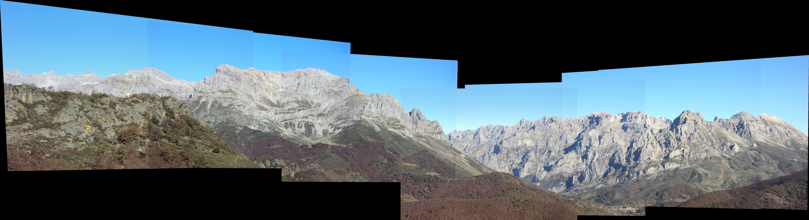
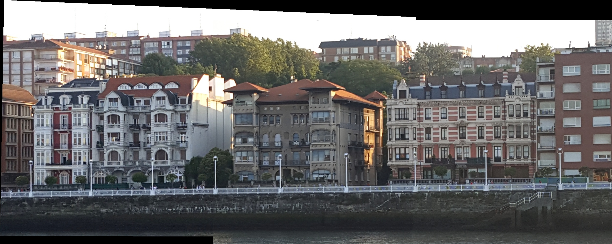
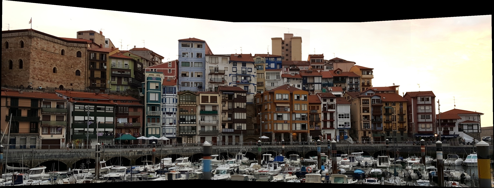
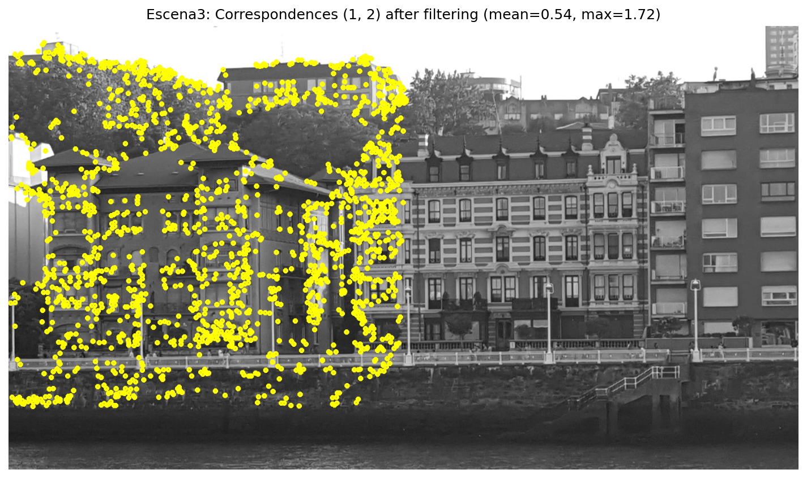

# Mosaic

[](https://pixi.sh)

Panoramic mosaic construction from overlapping images (TAVC assignment). The pipeline detects SIFT features,
matches descriptors, estimates homographies via DLT, filters outliers, and blends the warped images onto a
common canvas.



## Installation

The project uses [pixi](https://pixi.sh) (conda-based) to manage the environment.

1. Install pixi (if not already installed):

   ```sh
   curl -fsSL https://pixi.sh/install.sh | bash
   ```

2. Install the project dependencies (Python, OpenCV, NumPy, Matplotlib):

   ```sh
   pixi install
   ```

## Usage

Run the pipeline with pixi. By default it processes all three scenes (`Escena3`, `Escena4`, `Escena5`):

```sh
pixi run python mosaic.py
```

Process specific scenes:

```sh
pixi run python mosaic.py Escena5
```

Run the detector ablation study (SIFT, ORB, KAZE, BRISK):

```sh
pixi run python mosaic.py --ablation Escena5
```

Compare the outlier-filtering methods (residual, geometric, RANSAC):

```sh
pixi run python mosaic.py --filter-comparison Escena5
```

Output panoramas and diagnostic figures are written to the project directory.

## Results

Panoramas reconstructed for the three scenes:

| Scene | Images | Panorama |
| --- | --- | --- |
| Scene 3 (Ría del Nervión) | 2 |  |
| Scene 4 (Bermeo) | 3 |  |
| Scene 5 (Picos de Europa) | 7 |  |

Feature correspondences after outlier filtering (cyan: inliers; red lines: points above the error threshold):


